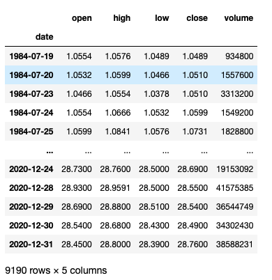
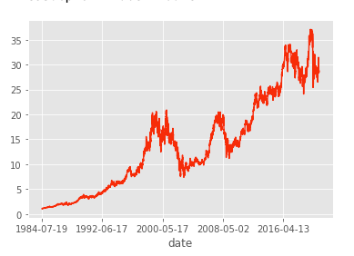

# ATT_Future_Stock_Price_Prediction

Stock price predicting is always one of the most important and polular application of time series modeling.

In this study, I'm showing a prediction of future stock price for the top company---AT&T

1.Let's take a look at the dataframe first:

Since the close price of everyday is a key feature for the pracise purpose, it is the value that will be predicted in this study.

Also, the volume as a reflection of outside events, it is a very important variable in my model.

2. The variable that I'm predicting is close price. 
   Here is the historical close price over time(daily for the past 36 years):

It is very clear that this time series has a trend. 

By the look of this, there's no clear evidance showing that wether it is a seasonal data or not.

So by calculating the ADF, the P-value is smaller than 0.05. So in our dataset, there is no seasonal affect.

3. Modeling and Evaluation:

  Two models are applied to this time series.
  After evaluation using RMSE metrix,
  the LSTM model which RMSE is 0.2605,
  out perform the ARIMA model which RMSE is 3.9038

  

